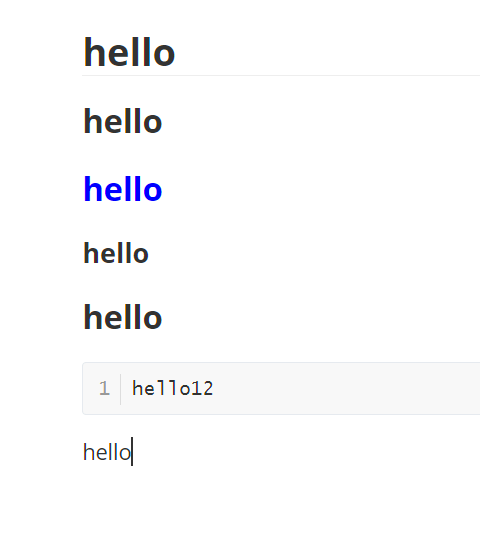
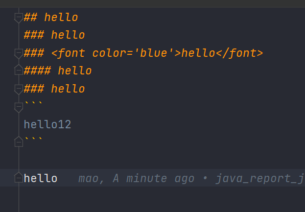
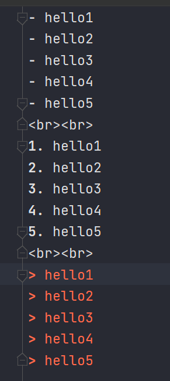
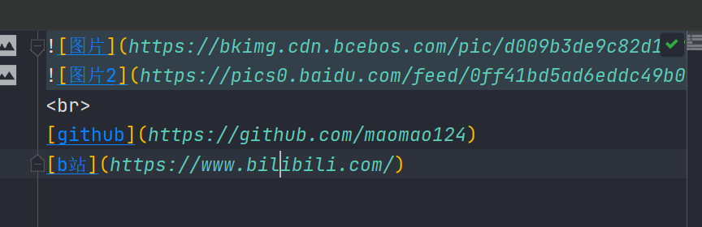
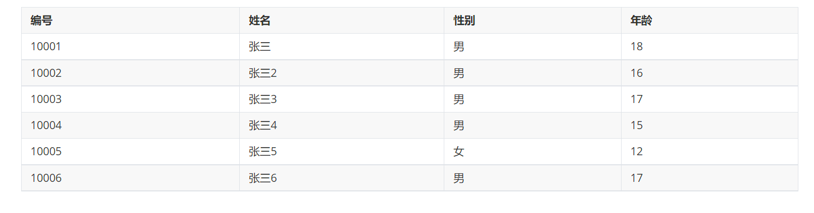
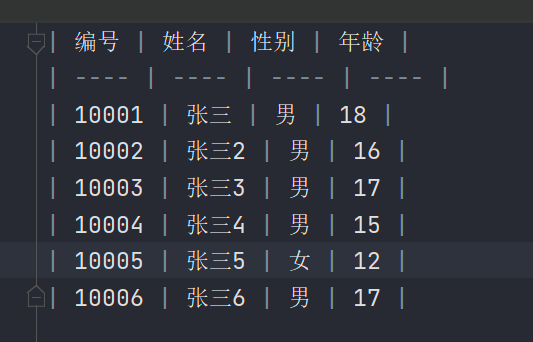
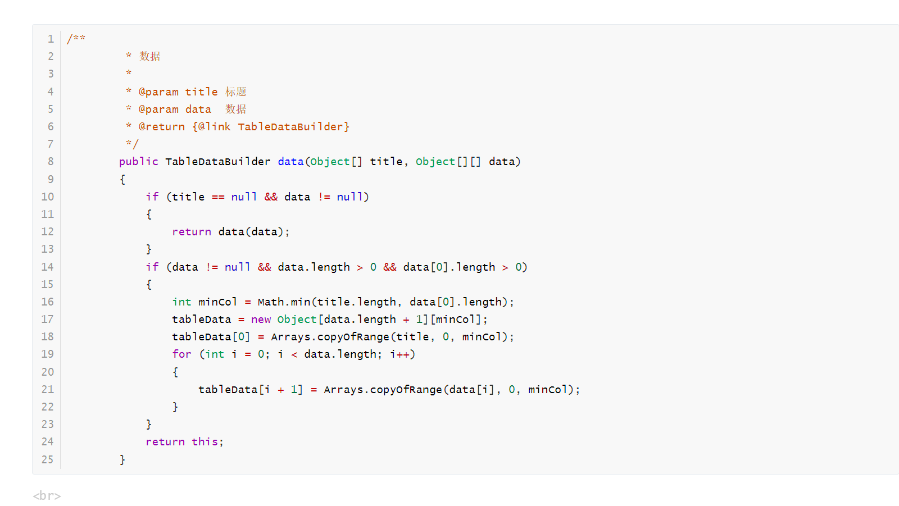
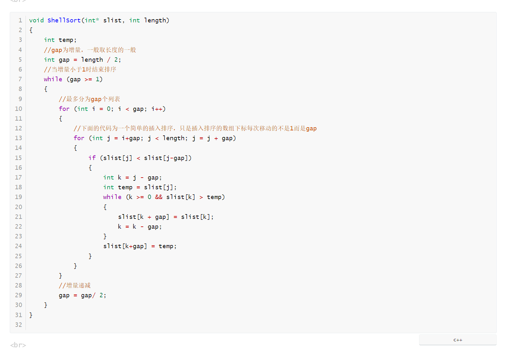
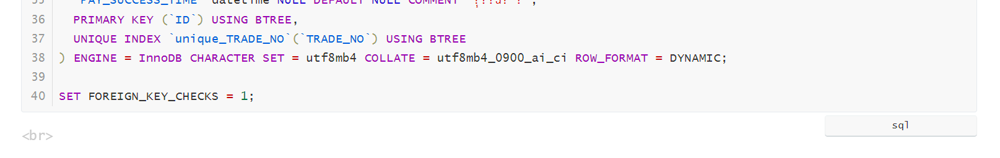
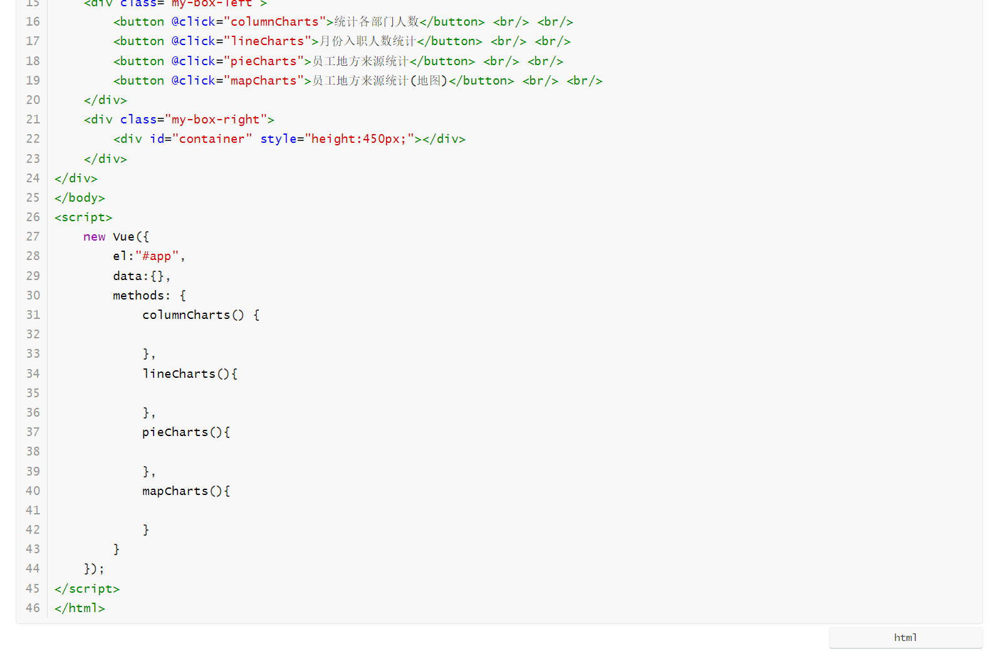

# Markdown

## 概述

Markdown 是一种轻量级标记语言，创始人为约翰·格鲁伯（John Gruber）。 它允许人们使用易读易写的纯文本格式编写文档，然后转换成有效的 XHTML（或者HTML）文档。这种语言吸收了很多在电子邮件中已有的纯文本标记的特性。
由于 Markdown 的轻量化、易读易写特性，并且对于图片，图表、数学式都有支持，许多网站都广泛使用 Markdown 来撰写帮助文档或是用于论坛上发表消息。 如 GitHub、Reddit、Diaspora、Stack Exchange、OpenStreetMap 、SourceForge、简书等，甚至还能被使用来撰写电子书。


## 优势

* 世界上最流行的博客平台WordPress和大型CMS如Joomla、Drupal都能很好的支持Markdown。完全采用Markdown编辑器的博客平台有Ghost和Typecho等。
* 用于编写说明文档，以“README.md”的文件名保存在软件的目录下面。
* Markdown可以快速转化为演讲PPT、Word产品文档甚至是用非常少量的代码完成最小可用原型。


## 常用语法

|     **Markdown语法**      |         **详解**          |                           **效果**                           |
| :-----------------------: | :-----------------------: | :----------------------------------------------------------: |
|         \*斜体\*          |            无             |                            *斜体*                            |
|        \*\*粗体**         |            无             |                           **粗体**                           |
|        # 一级标题         |       "#"后需加空格       |                              无                              |
|        ## 二级标题        | 以此类推三级标题为三个“#” |                              无                              |
|     [链接](http://a)      |   “[ ]”间为显示的超文本   | [链接](https://baike.baidu.com/item/链接/2665501?fromModule=lemma_inlink) |
|  |      “[ ]”间为图片名      | [](https://baike.baidu.com/pic/markdown/3245829/0/d009b3de9c82d158ccbf98bc1b430ed8bc3eb135e42e?fr=lemma&fromModule=lemma_content-image&ct=single) |
|        “ ＞ ”引用         |     “ ＞ ”后需加空格      |                              无                              |
|        * 无序列表         |            无             |                              无                              |
|        1. 有序列表        |            无             |                              无                              |
|            ---            |        水平分割线         |                             ————                             |
|    \`内联代码\` 的使用    |            无             |                              无                              |
|       \```代码块```       |            无             |                              无                              |
|         颜色代码          |            无             |                              无                              |
|      ***斜体+粗体***      |            无             |                       ***斜体+粗体\***                       |
|         居中格式          |           文字            |                             文字                             |
|         自动换行          |      例：1234567890       |                          1234567890                          |
|          输入框           |         例：1234          |                        输入框内的1234                        |
|        颜色第二种         |           文字            |                              无                              |
|         文字大小          |           文字            |                              无                              |
|           字体            |            无             |                              无                              |


## java导出Markdown


工具类：

```java
package mao.utils;

import java.io.FileOutputStream;
import java.io.OutputStreamWriter;
import java.nio.charset.StandardCharsets;
import java.util.*;

/**
 * Project name(项目名称)：java报表_java导出Markdown
 * Package(包名): mao.utils
 * Class(类名): MarkdownUtils
 * Author(作者）: mao
 * Author QQ：1296193245
 * GitHub：https://github.com/maomao124/
 * Date(创建日期)： 2023/6/8
 * Time(创建时间)： 13:09
 * Version(版本): 1.0
 * Description(描述)： 无
 */

public class MarkdownUtils
{

    /**
     * @return {@link SectionBuilder}
     */
    public static SectionBuilder of()
    {
        return new SectionBuilder(new Section(Section.Type.NORMAL, null, null, null, 0));
    }

    /**
     * 风格
     *
     * @date 2023/06/08
     */
    public enum Style
    {
        /**
         * 正常
         */
        NORMAL("normal"),
        /**
         * 大胆
         */
        BOLD("bold"),
        /**
         * 斜体
         */
        ITALIC("italic"),
        /**
         * 红色
         */
        RED("red"),
        /**
         * 绿色
         */
        GREEN("green"),
        /**
         * 灰色
         */
        GRAY("gray"),
        /**
         * 黄色
         */
        YELLOW("gold"),
        /**
         * 蓝色
         */
        BLUE("blue");

        /**
         * 名字
         */
        private final String name;

        /**
         * 风格
         *
         * @param name 名字
         */
        Style(String name)
        {
            this.name = name;
        }

        /**
         * 得到名字
         *
         * @return {@link String}
         */
        public String getName()
        {
            return name;
        }
    }

    /**
     * 字体
     *
     * @author mao
     * @date 2023/06/08
     */
    public static class Fonts
    {
        /**
         * 空
         */
        public static final Fonts EMPTY = Fonts.of("");
        /**
         * 文本
         */
        private final String text;

        /**
         * 风格
         */
        private Set<Style> styles = Collections.emptySet();

        /**
         * 字体
         *
         * @param text  文本
         * @param style 风格
         */
        private Fonts(String text, Style... style)
        {
            this.text = text != null ? text : "";
            if (style != null)
            {
                this.styles = new HashSet<>(Arrays.asList(style));
            }
        }


        /**
         * @param text 文本
         * @return {@link Fonts}
         */
        public static Fonts of(String text)
        {
            return new Fonts(text, Style.NORMAL);
        }

        /**
         * @param text  文本
         * @param style 风格
         * @return {@link Fonts}
         */
        public static Fonts of(String text, Style... style)
        {
            return new Fonts(text, style);
        }

        /**
         * 是空
         *
         * @return boolean
         */
        public boolean isEmpty()
        {
            return this.text == null || this.text.isEmpty();
        }

        /**
         * 字符串
         *
         * @return {@link String}
         */
        @Override
        public String toString()
        {
            if (styles.contains(Style.NORMAL))
            {
                return text;
            }
            String last = text;
            for (Style style : styles)
            {
                last = parseStyle(last, style);
            }
            return last;
        }

        /**
         * 解析风格
         *
         * @param text  文本
         * @param style 风格
         * @return {@link String}
         */
        private String parseStyle(String text, Style style)
        {
            if (text == null || style == null)
            {
                return text;
            }
            switch (style)
            {
                case NORMAL:
                    break;
                case BOLD:
                    return "**" + text + "**";
                case ITALIC:
                    return "*" + text + "*";
                case RED:
                case GREEN:
                case BLUE:
                case YELLOW:
                    return "<font color='" + style.getName() + "'>" + text + "</font>";
            }
            return text;
        }
    }

    /**
     * 代表一行，可以是一个普通文本或一个K-V(s)数据
     */
    public static class MetaData
    {

        /**
         * 默认分隔符
         */
        public static final String DEFAULT_SEPARATOR = "：";
        /**
         * 默认值分隔符
         */
        public static final String DEFAULT_VALUE_SEPARATOR = " | ";
        /**
         * 链接模板
         */
        public static final String LINK_TEMPLATE = "[%s](%s)";

        /**
         * 图片模板
         */
        public static final String PHOTO_TEMPLATE = "";


        /**
         * 类型
         */
        private final Type type;
        /**
         * 文本
         */
        private final Fonts text;
        /**
         * 值
         */
        private final Collection<Fonts> values;
        /**
         * 分隔符
         */
        private final String separator = DEFAULT_SEPARATOR;
        /**
         * 值分隔符
         */
        private final String valueSeparator = DEFAULT_VALUE_SEPARATOR;

        /**
         * 元数据
         *
         * @param text 文本
         */
        public MetaData(Fonts text)
        {
            this(text, null);
        }

        /**
         * 元数据
         *
         * @param type 类型
         */
        public MetaData(Type type)
        {
            this(type, null, null);
        }

        /**
         * 元数据
         *
         * @param text   文本
         * @param values 值
         */
        public MetaData(Fonts text, Collection<Fonts> values)
        {
            this(Type.NORMAL, text, values);
        }

        /**
         * 元数据
         *
         * @param type   类型
         * @param text   文本
         * @param values 值
         */
        public MetaData(Type type, Fonts text, Collection<Fonts> values)
        {
            this.type = type;
            this.text = text;
            this.values = values;
        }

        /**
         * 字符串
         *
         * @return {@link String}
         */
        @Override
        public String toString()
        {
            return generateString(this.valueSeparator);
        }

        /**
         * 生成字符串
         * generate one line
         *
         * @param valueSeparator 值分隔符
         * @return {@link String}
         */
        private String generateString(String valueSeparator)
        {
            boolean hasValues = values != null && !values.isEmpty();
            boolean hasText = text != null && !text.isEmpty();
            StringJoiner joiner = new StringJoiner(valueSeparator);
            String ret = "";
            switch (type)
            {
                case NORMAL:
                    if (hasText && hasValues)
                    {
                        values.forEach(v -> joiner.add(v.toString()));
                        ret = text + separator + joiner;
                    }
                    else if (!hasText && hasValues)
                    {
                        values.forEach(v -> joiner.add(v.toString()));
                        ret = joiner.toString();
                    }
                    else if (hasText)
                    {
                        ret = text.toString();
                    }
                    break;
                case LINK:
                    if (hasText && hasValues)
                    {
                        Fonts fonts = values.stream().findFirst().orElse(null);
                        if (fonts == null)
                        {
                            break;
                        }
                        ret = String.format(LINK_TEMPLATE, text, fonts);
                    }
                    else if (!hasText && hasValues)
                    {
                        Fonts url = values.stream().findFirst().orElse(null);
                        if (url == null)
                        {
                            break;
                        }
                        ret = String.format(LINK_TEMPLATE, url, url);
                    }
                    else if (hasText)
                    {
                        ret = String.format(LINK_TEMPLATE, text, text);
                    }
                    break;
                case LINK_LIST:
                    if (hasText && hasValues)
                    {
                        ret = text + separator + generateLinkList(values);
                    }
                    else if (!hasText && hasValues)
                    {
                        ret = generateLinkList(values);
                    }
                    else if (hasText)
                    {
                        ret = String.format(LINK_TEMPLATE, text, text);
                    }
                    break;
                case PHOTO:
                    if (hasText && hasValues)
                    {
                        Fonts fonts = values.stream().findFirst().orElse(null);
                        if (fonts == null)
                        {
                            break;
                        }
                        ret = String.format(PHOTO_TEMPLATE, text, fonts);
                    }
                    else if (!hasText && hasValues)
                    {
                        Fonts url = values.stream().findFirst().orElse(null);
                        if (url == null)
                        {
                            break;
                        }
                        ret = String.format(PHOTO_TEMPLATE, url, url);
                    }
                    else if (hasText)
                    {
                        ret = String.format(PHOTO_TEMPLATE, text, text);
                    }
                    break;
                case BR:
                    ret = "\n<br>";
            }
            return ret;
        }


        /**
         * 生成链接列表
         *
         * @param values 值
         * @return {@link String}
         */
        private String generateLinkList(Collection<Fonts> values)
        {
            if (values == null || values.isEmpty())
            {
                return "";
            }
            Object[] valueArr = values.toArray();
            StringJoiner linkList = new StringJoiner(valueSeparator);
            for (int i = 0; i + 1 < valueArr.length; i += 2)
            {
                linkList.add(String.format(LINK_TEMPLATE, valueArr[i], valueArr[i + 1]));
            }
            boolean isPairNum = (valueArr.length % 2) == 0;
            if (!isPairNum)
            {
                String lastUrl = valueArr[valueArr.length - 1].toString();
                linkList.add(String.format(LINK_TEMPLATE, lastUrl, lastUrl));
            }
            return linkList.toString();
        }

        private enum Type
        {
            /**
             * 正常
             */
            NORMAL,
            /**
             * 链接
             */
            LINK,

            /**
             * 照片
             */
            PHOTO,
            /**
             * 链接列表
             */
            LINK_LIST,
            /**
             * br
             */
            BR,
        }
    }


    private static class Section
    {
        /**
         * 深度
         */
        private final int depth;
        /**
         * 类型
         */
        private Type type;
        /**
         * 数据
         */
        private Object data;
        /**
         * 父
         */
        private Section parent;
        /**
         * 孩子们
         */
        private List<Section> children;


        /**
         * 语言类型,java,c++,c,python等
         */
        private String languageType = "";

        /**
         * 部分
         *
         * @param type     类型
         * @param data     数据
         * @param parent   父
         * @param children 孩子们
         * @param depth    深度
         */
        private Section(Type type, Object data, Section parent, List<Section> children, int depth)
        {
            this.type = type;
            this.data = data;
            this.parent = parent;
            this.children = children;
            this.depth = depth;
        }

        /**
         * 设置语言类型
         *
         * @param languageType 语言类型
         * @return {@link Section}
         */
        public Section setLanguageType(String languageType)
        {
            this.languageType = languageType;
            return this;
        }

        /**
         * 添加孩子
         *
         * @param child 孩子
         */
        public void addChild(Section child)
        {
            lazyInitChildren();
            children.add(child);
        }

        /**
         * 孩子是空
         *
         * @return boolean
         */
        public boolean childIsEmpty()
        {
            return children == null || children.isEmpty();
        }


        /**
         * 解析
         *
         * @param latestData 最新数据
         * @return {@link StringBuilder}
         */
        private StringBuilder parse(StringBuilder latestData)
        {
            switch (type)
            {
                case LINK:
                case NORMAL:
                    latestData.append('\n').append(parseData(""));
                    return latestData;
                case BIG_TITLE:
                    latestData.append('\n').append(parseData("## "));
                    return latestData;
                case TITLE:
                    latestData.append('\n').append(parseData("### "));
                    return latestData;
                case SUBTITLE:
                    latestData.append('\n').append(parseData("#### "));
                    return latestData;
                case REF:
                    return parseRefSection(latestData);
                case CODE:
                    StringBuilder codeBlock = new StringBuilder(latestData.length() + 10);
                    codeBlock.append("\n```").append(languageType).append(latestData).append("\n```");
                    return codeBlock;
                case ORDER_LIST:
                    return parseOrderListSection(latestData);
                case UN_ORDER_LIST:
                    return parseUnOrderListSection(latestData);
                case TABLE:
                    return parseTableSection(latestData);
                case BR:
                    return latestData.append(parseData(""));
            }
            return latestData;
        }

        /**
         * 解析数据
         *
         * @param prefix 前缀
         * @return {@link String}
         */
        private String parseData(String prefix)
        {
            if (data == null)
            {
                return "";
            }
            return prefix + data;
        }

        /**
         * 解析参考部分
         *
         * @param latestData 最新数据
         * @return {@link StringBuilder}
         */
        private StringBuilder parseRefSection(StringBuilder latestData)
        {
            char[] chars = latestData.toString().toCharArray();
            if (chars.length <= 0)
            {
                return latestData;
            }
            StringBuilder data = new StringBuilder(chars.length * 2);
            if (chars[0] != '\n')
            {
                data.append("> ");
            }
            char last = 0;
            for (char c : chars)
            {
                if (last == '\n')
                {
                    data.append("> ");
                }
                data.append(c);
                last = c;
            }
            return data;
        }

        /**
         * 解析顺序列表部分
         *
         * @param latestData 最新数据
         * @return {@link StringBuilder}
         */
        private StringBuilder parseOrderListSection(StringBuilder latestData)
        {
            char[] chars = latestData.toString().toCharArray();
            if (chars.length <= 0)
            {
                return latestData;
            }
            StringBuilder data = new StringBuilder(chars.length * 2);
            String padding = String.join("", Collections.nCopies(depth * 4, " "));
            int order = 1;
            if (chars[0] != '\n')
            {
                data.append(padding).append(order++).append(". ");
            }
            char last = 0;
            for (char c : chars)
            {
                if (last == '\n' && c != '\n' && c != ' ')
                {
                    data.append(padding).append(order++).append(". ");
                }
                data.append(c);
                last = c;
            }
            return data;
        }

        /**
         * 解析联合国订单列表部分
         *
         * @param latestData 最新数据
         * @return {@link StringBuilder}
         */
        private StringBuilder parseUnOrderListSection(StringBuilder latestData)
        {
            char[] chars = latestData.toString().toCharArray();
            if (chars.length <= 0)
            {
                return latestData;
            }
            StringBuilder data = new StringBuilder(chars.length * 2);
            String padding = String.join("", Collections.nCopies(depth * 4, " "));
            if (chars[0] != '\n')
            {
                data.append(padding).append("- ");
            }
            char last = 0;
            for (char c : chars)
            {
                if (last == '\n' && c != '\n' && c != ' ')
                {
                    data.append(padding).append("- ");
                }
                data.append(c);
                last = c;
            }
            return data;
        }

        /**
         * 解析表部分
         *
         * @param latestData 最新数据
         * @return {@link StringBuilder}
         */
        private StringBuilder parseTableSection(StringBuilder latestData)
        {
            if (data != null)
            {
                Object[][] tableData = (Object[][]) data;
                if (tableData.length > 0 && tableData[0].length > 0)
                {
                    StringJoiner titles = new StringJoiner(" | "), extras = new StringJoiner(" | ");
                    titles.add("");
                    for (Object t : tableData[0])
                    {
                        titles.add(t != null ? t.toString() : "");
                        extras.add("----");
                    }
                    titles.add("");
                    latestData.append("\n\n").append(titles).append("\n| ").append(extras).append(" |");
                    for (int i = 1; i < tableData.length; i++)
                    {
                        StringJoiner dataJoiner = new StringJoiner(" | ");
                        for (int j = 0; j < tableData[i].length; j++)
                        {
                            dataJoiner.add(tableData[i][j] != null ? tableData[i][j].toString() : "");
                        }
                        latestData.append('\n').append("| ").append(dataJoiner).append(" |");
                    }
                }
            }
            return latestData.append('\n');
        }

        /**
         * 延迟初始化孩子
         */
        private void lazyInitChildren()
        {
            if (children == null)
            {
                children = new ArrayList<>();
            }
        }


        /**
         * 得到类型
         *
         * @return {@link Type}
         */
        public Type getType()
        {
            return type;
        }

        /**
         * 设置类型
         *
         * @param type 类型
         */
        public void setType(Type type)
        {
            this.type = type;
        }

        /**
         * 得到数据
         *
         * @return {@link Object}
         */
        public Object getData()
        {
            return data;
        }

        /**
         * 设置数据
         *
         * @param data 数据
         */
        public void setData(Object data)
        {
            this.data = data;
        }

        /**
         * 得到父
         *
         * @return {@link Section}
         */
        public Section getParent()
        {
            return parent;
        }

        /**
         * 设置父
         *
         * @param parent 父
         */
        public void setParent(Section parent)
        {
            this.parent = parent;
        }

        /**
         * 得到孩子们
         *
         * @return {@link List}<{@link Section}>
         */
        public List<Section> getChildren()
        {
            return children;
        }

        /**
         * 设置孩子们
         *
         * @param children 孩子们
         */
        public void setChildren(List<Section> children)
        {
            this.children = children;
        }

        /**
         * 得到深度
         *
         * @return int
         */
        public int getDepth()
        {
            return depth;
        }

        private enum Type
        {
            /**
             * 正常
             */
            NORMAL,

            /**
             * 大标题
             */
            BIG_TITLE,

            /**
             * 标题
             */
            TITLE,

            /**
             * 副标题
             */
            SUBTITLE,

            /**
             * 裁判
             */
            REF,

            /**
             * 代码
             */
            CODE,

            /**
             * 表
             */
            TABLE,

            /**
             * 订单列表
             */
            ORDER_LIST,

            /**
             * 联合国订单列表
             */
            UN_ORDER_LIST,

            /**
             * 链接
             */
            LINK,

            /**
             * br
             */
            BR
        }
    }

    public static class SectionBuilder
    {
        /**
         * 解析器
         */
        private static final MdParser parser = new MdParser();
        /**
         * 坏蛋交会
         */
        private final Section curSec;
        /**
         * 父母交会
         */
        private Section parentSec;
        /**
         * 父母建设者
         */
        private SectionBuilder parentBuilder;

        /**
         * 部分施工
         *
         * @param curSec 坏蛋交会
         */
        private SectionBuilder(Section curSec)
        {
            this.curSec = curSec;
        }

        /**
         * 部分施工
         *
         * @param curSec        坏蛋交会
         * @param parentSec     父母交会
         * @param parentBuilder 父母建设者
         */
        private SectionBuilder(Section curSec, Section parentSec, SectionBuilder parentBuilder)
        {
            this.curSec = curSec;
            this.parentSec = parentSec;
            this.parentBuilder = parentBuilder;
        }


        /**
         * 文本
         *
         * @param text 文本
         * @return {@link SectionBuilder}
         */
        public SectionBuilder text(String text)
        {
            return text(text, (String) null);
        }

        /**
         * 文本
         *
         * @param name  名字
         * @param value 价值
         * @return {@link SectionBuilder}
         */
        public SectionBuilder text(String name, String value)
        {
            if (name != null)
            {
                Collection<Fonts> values
                        = value != null ? Collections.singletonList(Fonts.of(value)) : Collections.emptyList();
                curSec.addChild(new Section(Section.Type.NORMAL,
                        new MetaData(MetaData.Type.NORMAL, Fonts.of(name, (Style) null), values),
                        curSec, null, curSec.getDepth()));
            }
            return this;
        }

        /**
         * 文本
         *
         * @param text  文本
         * @param style 风格
         * @return {@link SectionBuilder}
         */
        public SectionBuilder text(String text, Style... style)
        {
            if (text != null)
            {
                curSec.addChild(new Section(Section.Type.NORMAL, new MetaData(Fonts.of(text, style)), curSec,
                        null, curSec.getDepth()));
            }
            return this;
        }

        /**
         * 文本
         *
         * @param values 值
         * @return {@link SectionBuilder}
         */
        public SectionBuilder text(Collection<String> values)
        {
            if (values != null && !values.isEmpty())
            {
                text(null, values);
            }
            return this;
        }

        /**
         * 文本
         *
         * @param name   名字
         * @param values 值
         * @return {@link SectionBuilder}
         */
        public SectionBuilder text(String name, Collection<String> values)
        {
            if (values == null || values.size() <= 0)
            {
                return text(name);
            }
            return text(name, null, values);
        }

        /**
         * 文本
         *
         * @param name       名字
         * @param valueStyle 价值风格
         * @param values     值
         * @return {@link SectionBuilder}
         */
        public SectionBuilder text(String name, Style valueStyle, Collection<String> values)
        {
            if (values == null || values.size() <= 0)
            {
                return text(name);
            }
            if (valueStyle == null)
            {
                valueStyle = Style.NORMAL;
            }
            List<Fonts> ele = new ArrayList<>(values.size());
            for (String value : values)
            {
                ele.add(Fonts.of(value, valueStyle));
            }
            curSec.addChild(new Section(Section.Type.NORMAL, new MetaData(Fonts.of(name), ele), curSec, null,
                    curSec.getDepth()));
            return this;
        }

        /**
         * 大标题
         *
         * @param title 标题
         * @return {@link SectionBuilder}
         */
        public SectionBuilder bigTitle(String title)
        {
            if (title != null && title.length() != 0)
            {
                curSec.addChild(new Section(Section.Type.BIG_TITLE, new MetaData(Fonts.of(title)), curSec,
                        null, curSec.getDepth()));
            }
            return this;
        }

        /**
         * 标题
         *
         * @param title 标题
         * @return {@link SectionBuilder}
         */
        public SectionBuilder title(String title)
        {
            return title(title, Style.NORMAL);
        }

        /**
         * 标题
         *
         * @param title 标题
         * @param color 颜色
         * @return {@link SectionBuilder}
         */
        public SectionBuilder title(String title, Style color)
        {
            if (title != null && title.length() != 0)
            {
                curSec.addChild(new Section(Section.Type.TITLE, new MetaData(Fonts.of(title, color)),
                        curSec, null, curSec.getDepth()));
            }
            return this;
        }

        /**
         * 标题
         *
         * @param title 标题
         * @param label 标签
         * @return {@link SectionBuilder}
         */
        public SectionBuilder title(String title, Fonts... label)
        {
            return title(title, null, label);
        }

        /**
         * 标题
         *
         * @param title      标题
         * @param titleColor 标题颜色
         * @param label      标签
         * @return {@link SectionBuilder}
         */
        public SectionBuilder title(String title, Style titleColor, Fonts... label)
        {
            if (title != null && title.length() != 0)
            {
                if (titleColor == null)
                {
                    titleColor = Style.NORMAL;
                }
                List<Fonts> labelList = label != null ? Arrays.asList(label) : Collections.emptyList();
                curSec.addChild(new Section(Section.Type.TITLE, new MetaData(Fonts.of(title, titleColor), labelList),
                        curSec, null, curSec.getDepth()));
            }
            return this;
        }

        /**
         * 子标题
         *
         * @param title 标题
         * @return {@link SectionBuilder}
         */
        public SectionBuilder subTitle(String title)
        {
            if (title != null && title.length() != 0)
            {
                curSec.addChild(new Section(Section.Type.SUBTITLE, new MetaData(Fonts.of(title)),
                        curSec, null, curSec.getDepth()));
            }
            return this;
        }

        /**
         * 裁判
         *
         * @return {@link SectionBuilder}
         */
        public SectionBuilder ref()
        {
            Section refSection = new Section(Section.Type.REF, null, curSec, new ArrayList<>(), curSec.getDepth());
            curSec.addChild(refSection);
            return new SectionBuilder(refSection, curSec, this);
        }

        /**
         * 最终裁判
         *
         * @return {@link SectionBuilder}
         */
        public SectionBuilder endRef()
        {
            return this.parentBuilder != null ? this.parentBuilder : this;
        }

        /**
         * 表
         *
         * @return {@link TableDataBuilder}
         */
        public TableDataBuilder table()
        {
            return new TableDataBuilder(curSec, this);
        }

        /**
         * 链接
         *
         * @param url url
         * @return {@link SectionBuilder}
         */
        public SectionBuilder link(String url)
        {
            return link(null, url);
        }

        /**
         * 链接
         *
         * @param name 名字
         * @param url  url
         * @return {@link SectionBuilder}
         */
        public SectionBuilder link(String name, String url)
        {
            if (name == null || name.length() == 0)
            {
                name = url;
            }
            if (url != null && url.length() != 0)
            {
                MetaData links = new MetaData(MetaData.Type.LINK, Fonts.of(name),
                        Collections.singletonList(Fonts.of(url)));
                curSec.addChild(new Section(Section.Type.NORMAL, links, curSec, null, curSec.getDepth()));
            }
            return this;
        }

        /**
         * 链接
         *
         * @param urlMappings url映射
         * @return {@link SectionBuilder}
         */
        public SectionBuilder links(Map<String, String> urlMappings)
        {
            return links(null, urlMappings);
        }

        /**
         * 链接
         *
         * @param name        名字
         * @param urlMappings url映射
         * @return {@link SectionBuilder}
         */
        public SectionBuilder links(String name, Map<String, String> urlMappings)
        {
            if (urlMappings != null && !urlMappings.isEmpty())
            {
                List<Fonts> serialUrlInfos = new ArrayList<>();
                for (Map.Entry<String, String> entry : urlMappings.entrySet())
                {
                    String key = entry.getKey();
                    String value = entry.getValue();
                    serialUrlInfos.add(Fonts.of(key != null ? key : ""));
                    serialUrlInfos.add(Fonts.of(value != null ? value : ""));
                }
                Fonts wrappedName = name != null && name.length() != 0 ? Fonts.of(name) : Fonts.EMPTY;
                MetaData linksGroup = new MetaData(MetaData.Type.LINK_LIST, wrappedName, serialUrlInfos);
                curSec.addChild(new Section(Section.Type.NORMAL, linksGroup, curSec, null, curSec.getDepth()));
            }
            return this;
        }

        /**
         * 照片
         *
         * @param name 名字
         * @param url  url
         * @return {@link SectionBuilder}
         */
        public SectionBuilder photo(String name, String url)
        {
            if (name == null || name.length() == 0)
            {
                name = url;
            }
            if (url != null && url.length() != 0)
            {
                MetaData links = new MetaData(MetaData.Type.PHOTO, Fonts.of(name),
                        Collections.singletonList(Fonts.of(url)));
                curSec.addChild(new Section(Section.Type.NORMAL, links, curSec, null, curSec.getDepth()));
            }
            return this;
        }

        /**
         * 照片
         *
         * @param url url
         * @return {@link SectionBuilder}
         */
        public SectionBuilder photo(String url)
        {
            return photo(null, url);
        }


        /**
         * ol
         *
         * @return {@link SectionBuilder}
         */
        public SectionBuilder ol()
        {
            int depth = (curSec.getType() == Section.Type.ORDER_LIST || curSec.getType() == Section.Type.UN_ORDER_LIST)
                    ? curSec.getDepth() + 1
                    : curSec.getDepth();
            Section OrderListSec = new Section(Section.Type.ORDER_LIST, null, curSec, new ArrayList<>(), depth);
            curSec.addChild(OrderListSec);
            return new SectionBuilder(OrderListSec, curSec, this);
        }

        /**
         * ol结束
         *
         * @return {@link SectionBuilder}
         */
        public SectionBuilder endOl()
        {
            return this.parentBuilder != null ? this.parentBuilder : this;
        }

        /**
         * ul
         *
         * @return {@link SectionBuilder}
         */
        public SectionBuilder ul()
        {
            int depth = (curSec.getType() == Section.Type.ORDER_LIST || curSec.getType() == Section.Type.UN_ORDER_LIST)
                    ? curSec.getDepth() + 1
                    : curSec.getDepth();
            Section unOrderListSec = new Section(Section.Type.UN_ORDER_LIST, null, curSec, new ArrayList<>(), depth);
            curSec.addChild(unOrderListSec);
            return new SectionBuilder(unOrderListSec, curSec, this);
        }

        /**
         * ul结束
         *
         * @return {@link SectionBuilder}
         */
        public SectionBuilder endUl()
        {
            return this.parentBuilder != null ? this.parentBuilder : this;
        }

        /**
         * 代码
         *
         * @return {@link SectionBuilder}
         */
        public SectionBuilder code()
        {
            Section codeSec = new Section(Section.Type.CODE, null, curSec, new ArrayList<>(), curSec.getDepth());
            curSec.addChild(codeSec);
            return new SectionBuilder(codeSec, curSec, this);
        }

        /**
         * 代码
         *
         * @param languageType 语言类型
         * @return {@link SectionBuilder}
         */
        public SectionBuilder code(String languageType)
        {
            if (languageType == null)
            {
                languageType = "";
            }
            Section codeSec = new Section(Section.Type.CODE, null, curSec, new ArrayList<>(), curSec.getDepth());
            codeSec.setLanguageType(languageType);
            curSec.addChild(codeSec);
            return new SectionBuilder(codeSec, curSec, this);
        }

        /**
         * 最终代码
         *
         * @return {@link SectionBuilder}
         */
        public SectionBuilder endCode()
        {
            return this.parentBuilder != null ? this.parentBuilder : this;
        }

        /**
         * br
         *
         * @return {@link SectionBuilder}
         */
        public SectionBuilder br()
        {
            curSec.addChild(new Section(Section.Type.BR, new MetaData(MetaData.Type.BR), parentSec, null,
                    curSec.getDepth()));
            return this;
        }

        /**
         * 构建
         *
         * @return {@link String}
         */
        public String build()
        {
            return parser.parse(curSec);
        }
    }

    public static class TableDataBuilder
    {
        /**
         * 父母交会
         */
        private final Section parentSec;
        /**
         * 父母建设者
         */
        private final SectionBuilder parentBuilder;
        /**
         * 表数据
         */
        private Object[][] tableData;

        /**
         * 表数据生成器
         *
         * @param parentSec     父母交会
         * @param parentBuilder 父母建设者
         */
        private TableDataBuilder(Section parentSec, SectionBuilder parentBuilder)
        {
            this.parentSec = parentSec;
            this.parentBuilder = parentBuilder;
        }


        /**
         * 数据
         *
         * @param table 表
         * @return {@link TableDataBuilder}
         */
        public TableDataBuilder data(Object[][] table)
        {
            if (table != null && table.length > 0 && table[0].length > 0)
            {
                tableData = table;
            }
            return this;
        }

        /**
         * 数据
         *
         * @param title 标题
         * @param data  数据
         * @return {@link TableDataBuilder}
         */
        public TableDataBuilder data(Object[] title, Object[][] data)
        {
            if (title == null && data != null)
            {
                return data(data);
            }
            if (data != null && data.length > 0 && data[0].length > 0)
            {
                int minCol = Math.min(title.length, data[0].length);
                tableData = new Object[data.length + 1][minCol];
                tableData[0] = Arrays.copyOfRange(title, 0, minCol);
                for (int i = 0; i < data.length; i++)
                {
                    tableData[i + 1] = Arrays.copyOfRange(data[i], 0, minCol);
                }
            }
            return this;
        }

        /**
         * 表格结束
         *
         * @return {@link SectionBuilder}
         */
        public SectionBuilder endTable()
        {
            parentSec.addChild(new Section(Section.Type.TABLE, tableData, parentSec, null, parentSec.getDepth()));
            return parentBuilder;
        }
    }

    private static class MdParser
    {

        /**
         * 解析
         *
         * @param sec 证券交易委员会
         * @return {@link String}
         */
        public String parse(Section sec)
        {
            Section root = findRoot(sec);
            return doParse(root, root).toString().trim();
        }

        /**
         * 找到根源
         *
         * @param sec 证券交易委员会
         * @return {@link Section}
         */
        private Section findRoot(Section sec)
        {
            if (sec.getParent() == null)
            {
                return sec;
            }
            return findRoot(sec.getParent());
        }

        /**
         * 做解析
         *
         * @param cur  坏蛋
         * @param root 根
         * @return {@link StringBuilder}
         */
        private StringBuilder doParse(Section cur, Section root)
        {
            if (cur == null)
            {
                return null;
            }
            if (cur.childIsEmpty())
            {
                return cur.parse(new StringBuilder());
            }
            StringBuilder childData = new StringBuilder();
            for (Section child : cur.getChildren())
            {
                StringBuilder part = doParse(child, root);
                if (part != null)
                {
                    childData.append(part);
                }
            }
            return cur.parse(childData).append(cur.getParent() == root ? '\n' : "");
        }
    }


    /**
     * 写入到磁盘
     *
     * @param str  str
     * @param path 路径
     */
    public static void write(String str, String path)
    {
        try (FileOutputStream fileOutputStream = new FileOutputStream(path);
             OutputStreamWriter outputStreamWriter = new OutputStreamWriter(fileOutputStream, StandardCharsets.UTF_8))
        {
            outputStreamWriter.write(str);
            outputStreamWriter.flush();
        }
        catch (Exception e)
        {
            throw new RuntimeException(e);
        }
    }
}
```


测试1

```java
package mao;

import mao.utils.MarkdownUtils;

/**
 * Project name(项目名称)：java报表_java导出Markdown
 * Package(包名): mao
 * Class(类名): Test1
 * Author(作者）: mao
 * Author QQ：1296193245
 * GitHub：https://github.com/maomao124/
 * Date(创建日期)： 2023/6/8
 * Time(创建时间)： 13:09
 * Version(版本): 1.0
 * Description(描述)： 无
 */

public class Test1
{
    public static void main(String[] args)
    {
        String s = MarkdownUtils.of()
                .bigTitle("hello")
                .title("hello")
                .title("hello", MarkdownUtils.Style.BLUE)
                .subTitle("hello")
                .title("hello")
                .code()
                .text("hello12")
                .endCode()
                .text("hello").build();
        System.out.println(s);
        MarkdownUtils.write(s,"./test.md");
    }
}
```








测试2

```java
package mao;

import mao.utils.MarkdownUtils;

/**
 * Project name(项目名称)：java报表_java导出Markdown
 * Package(包名): mao
 * Class(类名): Test2
 * Author(作者）: mao
 * Author QQ：1296193245
 * GitHub：https://github.com/maomao124/
 * Date(创建日期)： 2023/6/8
 * Time(创建时间)： 13:33
 * Version(版本): 1.0
 * Description(描述)： 无
 */

public class Test2
{
    public static void main(String[] args)
    {
        String s = MarkdownUtils.of()
                .ul()
                .text("hello1")
                .text("hello2")
                .text("hello3")
                .text("hello4")
                .text("hello5")
                .endUl()
                .br()
                .br()
                .ol()
                .text("hello1")
                .text("hello2")
                .text("hello3")
                .text("hello4")
                .text("hello5")
                .endOl()
                .br()
                .br()
                .ref()
                .text("hello1")
                .text("hello2")
                .text("hello3")
                .text("hello4")
                .text("hello5")
                .endRef()
                .build();
        System.out.println(s);
        MarkdownUtils.write(s, "test2.md");
    }
}
```





测试3

```java
package mao;

import mao.utils.MarkdownUtils;

/**
 * Project name(项目名称)：java报表_java导出Markdown
 * Package(包名): mao
 * Class(类名): Test3
 * Author(作者）: mao
 * Author QQ：1296193245
 * GitHub：https://github.com/maomao124/
 * Date(创建日期)： 2023/6/8
 * Time(创建时间)： 13:39
 * Version(版本): 1.0
 * Description(描述)： 无
 */

public class Test3
{
    public static void main(String[] args)
    {
        String s = MarkdownUtils.of()
                .photo("图片", "https://bkimg.cdn.bcebos.com/pic/d009b3de9c82d158ccbf98bc1b430ed8bc3e" +
                        "b135e42e?x-bce-process=image/resize,m_lfit,w_440,limit_1")
                .photo("图片2", "https://pics0.baidu.com/feed/0ff41bd5ad6eddc49b0e4e404d077cfa50663380.jpeg@" +
                        "f_auto?token=a369c5afb4356baf7c521ae972f7e983&s=19C3336E2D621719085AD210020050C9")
                .br()
                .link("github", "https://github.com/maomao124")
                .link("b站", "https://www.bilibili.com/")
                .build();
        System.out.println(s);
        MarkdownUtils.write(s, "test3.md");
    }
}
```





测试4:

```java
package mao;

import mao.utils.MarkdownUtils;

/**
 * Project name(项目名称)：java报表_java导出Markdown
 * Package(包名): mao
 * Class(类名): Test4
 * Author(作者）: mao
 * Author QQ：1296193245
 * GitHub：https://github.com/maomao124/
 * Date(创建日期)： 2023/6/8
 * Time(创建时间)： 13:57
 * Version(版本): 1.0
 * Description(描述)： 无
 */

public class Test4
{
    public static void main(String[] args)
    {
        Object[] objects1 = new Object[]{"10001", "张三", "男", "18"};
        Object[] objects2 = new Object[]{"10002", "张三2", "男", "16"};
        Object[] objects3 = new Object[]{"10003", "张三3", "男", "17"};
        Object[] objects4 = new Object[]{"10004", "张三4", "男", "15"};
        Object[] objects5 = new Object[]{"10005", "张三5", "女", "12"};
        Object[] objects6 = new Object[]{"10006", "张三6", "男", "17"};

        String s = MarkdownUtils.of()

                .table()
                .data(new String[]{"编号", "姓名", "性别", "年龄"},
                        new Object[][]{objects1, objects2, objects3, objects4, objects5, objects6})
                .endTable()
                .build();
        System.out.println(s);
        MarkdownUtils.write(s, "test4.md");
    }
}
```








测试5

```java
package mao;

import mao.utils.MarkdownUtils;

/**
 * Project name(项目名称)：java报表_java导出Markdown
 * Package(包名): mao
 * Class(类名): Test5
 * Author(作者）: mao
 * Author QQ：1296193245
 * GitHub：https://github.com/maomao124/
 * Date(创建日期)： 2023/6/8
 * Time(创建时间)： 14:22
 * Version(版本): 1.0
 * Description(描述)： 无
 */

public class Test5
{
    public static void main(String[] args)
    {
        String s = MarkdownUtils.of()
                .code("java")
                .text("/**\n" +
                        "         * 数据\n" +
                        "         *\n" +
                        "         * @param title 标题\n" +
                        "         * @param data  数据\n" +
                        "         * @return {@link TableDataBuilder}\n" +
                        "         */\n" +
                        "        public TableDataBuilder data(Object[] title, Object[][] data)\n" +
                        "        {\n" +
                        "            if (title == null && data != null)\n" +
                        "            {\n" +
                        "                return data(data);\n" +
                        "            }\n" +
                        "            if (data != null && data.length > 0 && data[0].length > 0)\n" +
                        "            {\n" +
                        "                int minCol = Math.min(title.length, data[0].length);\n" +
                        "                tableData = new Object[data.length + 1][minCol];\n" +
                        "                tableData[0] = Arrays.copyOfRange(title, 0, minCol);\n" +
                        "                for (int i = 0; i < data.length; i++)\n" +
                        "                {\n" +
                        "                    tableData[i + 1] = Arrays.copyOfRange(data[i], 0, minCol);\n" +
                        "                }\n" +
                        "            }\n" +
                        "            return this;\n" +
                        "        }")
                .endCode()

                .br()

                .code("c++")
                .text("void ShellSort(int* slist, int length)\n" +
                        "{\n" +
                        "    int temp;\n" +
                        "    //gap为增量，一般取长度的一般\n" +
                        "    int gap = length / 2;\n" +
                        "    //当增量小于1时结束排序\n" +
                        "    while (gap >= 1)\n" +
                        "    {\n" +
                        "        //最多分为gap个列表\n" +
                        "        for (int i = 0; i < gap; i++)\n" +
                        "        {\n" +
                        "            //下面的代码为一个简单的插入排序，只是插入排序的数组下标每次移动的不是1而是gap\n" +
                        "            for (int j = i+gap; j < length; j = j + gap)\n" +
                        "            {\n" +
                        "                if (slist[j] < slist[j-gap])\n" +
                        "                {\n" +
                        "                    int k = j - gap;\n" +
                        "                    int temp = slist[j];\n" +
                        "                    while (k >= 0 && slist[k] > temp)\n" +
                        "                    {\n" +
                        "                        slist[k + gap] = slist[k];\n" +
                        "                        k = k - gap;\n" +
                        "                    }\n" +
                        "                    slist[k+gap] = temp;\n" +
                        "                }\n" +
                        "            }\n" +
                        "        }\n" +
                        "        //增量递减\n" +
                        "        gap = gap/ 2;\n" +
                        "    }\n" +
                        "}\n")
                .endCode()

                .br()

                .code("sql")
                .text("SET NAMES utf8mb4;\n" +
                        "SET FOREIGN_KEY_CHECKS = 0;\n" +
                        "\n" +
                        "-- ----------------------------\n" +
                        "-- Table structure for pay_order\n" +
                        "-- ----------------------------\n" +
                        "DROP TABLE IF EXISTS `pay_order`;\n" +
                        "CREATE TABLE `pay_order`  (\n" +
                        "  `ID` bigint NOT NULL,\n" +
                        "  `TRADE_NO` varchar(50) CHARACTER SET utf8mb4 COLLATE utf8mb4_0900_ai_ci NOT NULL COMMENT '?ۺ?֧???????',\n" +
                        "  `MERCHANT_ID` bigint NOT NULL COMMENT '?????̻?',\n" +
                        "  `STORE_ID` bigint NULL DEFAULT NULL COMMENT '?̻????ŵ',\n" +
                        "  `APP_ID` varchar(50) CHARACTER SET utf8mb4 COLLATE utf8mb4_0900_ai_ci NOT NULL COMMENT '????Ӧ?',\n" +
                        "  `PAY_CHANNEL` varchar(50) CHARACTER SET utf8mb4 COLLATE utf8mb4_0900_ai_ci NULL DEFAULT NULL COMMENT 'ԭʼ֧?????????',\n" +
                        "  `PAY_CHANNEL_MCH_ID` varchar(50) CHARACTER SET utf8mb4 COLLATE utf8mb4_0900_ai_ci NULL DEFAULT NULL COMMENT 'ԭʼ?????̻?id',\n" +
                        "  `PAY_CHANNEL_MCH_APP_ID` varchar(50) CHARACTER SET utf8mb4 COLLATE utf8mb4_0900_ai_ci NULL DEFAULT NULL COMMENT 'ԭʼ?????̻?Ӧ??id',\n" +
                        "  `PAY_CHANNEL_TRADE_NO` varchar(50) CHARACTER SET utf8mb4 COLLATE utf8mb4_0900_ai_ci NULL DEFAULT NULL COMMENT 'ԭʼ?????????',\n" +
                        "  `CHANNEL` varchar(50) CHARACTER SET utf8mb4 COLLATE utf8mb4_0900_ai_ci NULL DEFAULT NULL COMMENT '?ۺ?֧?????',\n" +
                        "  `OUT_TRADE_NO` varchar(50) CHARACTER SET utf8mb4 COLLATE utf8mb4_0900_ai_ci NULL DEFAULT NULL COMMENT '?̻??????',\n" +
                        "  `SUBJECT` varchar(50) CHARACTER SET utf8mb4 COLLATE utf8mb4_0900_ai_ci NULL DEFAULT NULL COMMENT '??Ʒ???',\n" +
                        "  `BODY` varchar(256) CHARACTER SET utf8mb4 COLLATE utf8mb4_0900_ai_ci NULL DEFAULT NULL COMMENT '???????',\n" +
                        "  `CURRENCY` varchar(50) CHARACTER SET utf8mb4 COLLATE utf8mb4_0900_ai_ci NULL DEFAULT NULL COMMENT '????CNY',\n" +
                        "  `TOTAL_AMOUNT` int NULL DEFAULT NULL COMMENT '?????ܽ??\uE8EC??λΪ?',\n" +
                        "  `OPTIONAL` varchar(256) CHARACTER SET utf8mb4 COLLATE utf8mb4_0900_ai_ci NULL DEFAULT NULL COMMENT '?û??Զ????IJ???,?̻??Զ????',\n" +
                        "  `ANALYSIS` varchar(256) CHARACTER SET utf8mb4 COLLATE utf8mb4_0900_ai_ci NULL DEFAULT NULL COMMENT '????ͳ?Ʒ?????????,?û??Զ??',\n" +
                        "  `EXTRA` varchar(512) CHARACTER SET utf8mb4 COLLATE utf8mb4_0900_ai_ci NULL DEFAULT NULL COMMENT '?ض?????????ʱ???????',\n" +
                        "  `TRADE_STATE` varchar(50) CHARACTER SET utf8mb4 COLLATE utf8mb4_0900_ai_ci NULL DEFAULT NULL COMMENT '????״̬֧??״̬,0-????????,1-֧????(Ŀǰδʹ??),2-֧???ɹ?,3-ҵ??????????,4-?ر',\n" +
                        "  `ERROR_CODE` varchar(50) CHARACTER SET utf8mb4 COLLATE utf8mb4_0900_ai_ci NULL DEFAULT NULL COMMENT '????֧?????',\n" +
                        "  `ERROR_MSG` varchar(256) CHARACTER SET utf8mb4 COLLATE utf8mb4_0900_ai_ci NULL DEFAULT NULL COMMENT '????֧????????Ϣ',\n" +
                        "  `DEVICE` varchar(50) CHARACTER SET utf8mb4 COLLATE utf8mb4_0900_ai_ci NULL DEFAULT NULL COMMENT '?豸',\n" +
                        "  `CLIENT_IP` varchar(50) CHARACTER SET utf8mb4 COLLATE utf8mb4_0900_ai_ci NULL DEFAULT NULL COMMENT '?ͻ???IP',\n" +
                        "  `CREATE_TIME` datetime NULL DEFAULT NULL COMMENT '????ʱ?',\n" +
                        "  `UPDATE_TIME` datetime NULL DEFAULT NULL COMMENT '????ʱ?',\n" +
                        "  `EXPIRE_TIME` datetime NULL DEFAULT NULL COMMENT '????????ʱ?',\n" +
                        "  `PAY_SUCCESS_TIME` datetime NULL DEFAULT NULL COMMENT '֧???ɹ?ʱ?',\n" +
                        "  PRIMARY KEY (`ID`) USING BTREE,\n" +
                        "  UNIQUE INDEX `unique_TRADE_NO`(`TRADE_NO`) USING BTREE\n" +
                        ") ENGINE = InnoDB CHARACTER SET = utf8mb4 COLLATE = utf8mb4_0900_ai_ci ROW_FORMAT = DYNAMIC;\n" +
                        "\n" +
                        "SET FOREIGN_KEY_CHECKS = 1;")
                .endCode()

                .br()

                .code("html")
                .text("<!DOCTYPE html>\n" +
                        "<html>\n" +
                        "<head>\n" +
                        "    <meta charset=\"UTF-8\">\n" +
                        "    <meta name=\"viewport\" content=\"width=device-width, initial-scale=1.0,user-scalable=no,minimal-ui\" />\n" +
                        "    <title>echarts图表报表</title>\n" +
                        "    <link rel=\"stylesheet\" href=\"css/charts_demo.css\">\n" +
                        "    <script src=\"js/vuejs-2.5.16.js\"></script>\n" +
                        "    <script src=\"js/axios-0.18.0.js\"></script>\n" +
                        "    <script src=\"js/echarts.min.js\"></script>\n" +
                        "\n" +
                        "</head>\n" +
                        "<body>\n" +
                        "<div id=\"app\" class=\"my-box\">\n" +
                        "    <div class=\"my-box-left\">\n" +
                        "        <button @click=\"columnCharts\">统计各部门人数</button> <br/> <br/>\n" +
                        "        <button @click=\"lineCharts\">月份入职人数统计</button> <br/> <br/>\n" +
                        "        <button @click=\"pieCharts\">员工地方来源统计</button> <br/> <br/>\n" +
                        "        <button @click=\"mapCharts\">员工地方来源统计(地图)</button> <br/> <br/>\n" +
                        "    </div>\n" +
                        "    <div class=\"my-box-right\">\n" +
                        "        <div id=\"container\" style=\"height:450px;\"></div>\n" +
                        "    </div>\n" +
                        "</div>\n" +
                        "</body>\n" +
                        "<script>\n" +
                        "    new Vue({\n" +
                        "        el:\"#app\",\n" +
                        "        data:{},\n" +
                        "        methods: {\n" +
                        "            columnCharts() {\n" +
                        "\n" +
                        "            },\n" +
                        "            lineCharts(){\n" +
                        "\n" +
                        "            },\n" +
                        "            pieCharts(){\n" +
                        "\n" +
                        "            },\n" +
                        "            mapCharts(){\n" +
                        "\n" +
                        "            }\n" +
                        "        }\n" +
                        "    });\n" +
                        "</script>\n" +
                        "</html>")
                .endCode()
                .build();
        System.out.println(s);
        MarkdownUtils.write(s, "./test5.md");
    }
}
```














